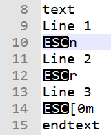
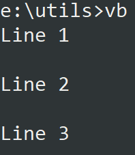

When using TEXT..ENDTEXT in a LIBRARY function, I cannot get a blank line. Example;

```dos
Test {
text
1

2

3
endtext
}
```

...returns...

```dos
e:\utils>which test
test is a library function

e:\utils>test
text
1
2
3
```

Rex Conn says;

> TCC strips all leading & trailing whitespace from the line.<br>
If the line is (then) empty,<br>
TCC doesn't save it in memory.<br>
If you want to display blank lines, use escape sequences.

From Notepad++,<br>
I used ALT 027 from the numeric keypad,<br>
which gives me the following;



...and all of them provide a blank line;



Ref: https://jpsoft.com/forums/threads/no-blank-line-in-text-endtext-in-a-library-function.10417/#post-58792
