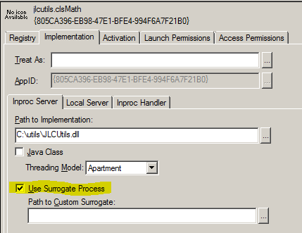
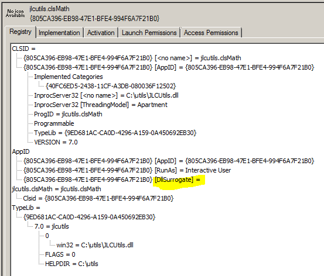

# Using a 32-bit In-Process COM Server DLL from 64-bit TCC

I have found a method to use the 32-bit In-Process COM Server DLLs that I have created using Visual Basic 6.0 and Visual FoxPro 9.0 from 64-bit TCC via PSHELL.

Using the Microsoft OLE/COM Object Viewer, I expand the **All Objects** tree, and locate the target 32-bit In-Process COM Server DLL, in my example, **jlcutils.clsMath**
Ref:
From the **Implementation** tab, I check the **Use Surrogate Process**;



From the Registry tab, I ensure that the **AppID** has a **DllSurrogate** entry;


Now, from 64-bit TCC, I can do;
```dos
pshell /s "$p = new-object -com jlcutils.clsMath"
```
to initialize my 32-bit COM Server, and 
```dos
c:\users\jlc\utils>pshell /s "$p.ppp(8.80)"
3.9952
```
to access a function.

The **@REG** functions can be used to do what I have done via the OLE/COM Object Viewer, but I have not explored that option yet.

If I did not make these changes, when attempting to initialize my 32-bit COM Server, I would get;

```dos
c:\users\jlc\utils>pshell /s "$p = new-object -com jlcutils.clsMath"
PSHELL: System.Management.Automation.CmdletInvocationException : Retrieving the COM class factory for component with CLSID {80
5CA396-EB98-47E1-BFE4-994F6A7F21B0} failed due to the following error: 80040154 Class not registered (Exception from HRESULT:
0x80040154 (REGDB_E_CLASSNOTREG)).
```
This method does not work for 32-bit Out-Of-Process COM Server EXEs, but I am hoping that this can be made possible in the next version of TCC.

Ref: [Using a 32-bit In-Process COM Server DLL from 64-bit TCC](https://jpsoft.com/forums/threads/using-a-32-bit-in-process-com-server-dll-from-64-bit-tcc.9646/)
